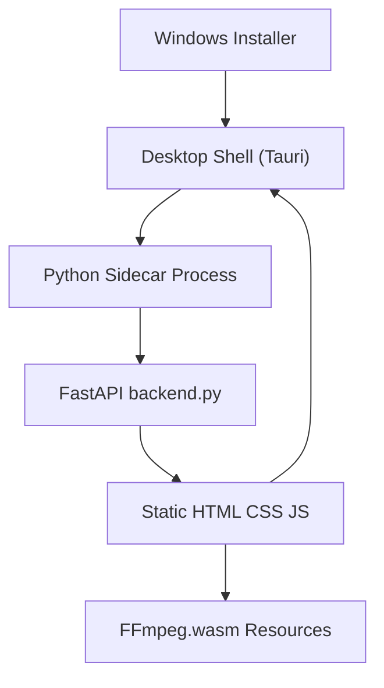

# VNASeek Windows Desktop Packaging Design

Feature Name: windows-desktop-packaging
Updated: 2026-05-06

## Description

本方案在不破坏现有 `beat_analyzer/` Web 应用结构的前提下，为 VNASeek 增加一个 Windows 桌面发布形态。核心思路是保留当前 FastAPI 后端与原生 Web 前端，将桌面版实现为独立的壳层工程，负责进程启动、窗口承载、安装打包和桌面资源集成。与此同时，对现有前端补充统一的品牌页脚，并为安装包、程序窗口、开始菜单和快捷方式准备多尺寸图标资源。

推荐技术路线为 `Tauri + Python sidecar`。Tauri 负责提供 Windows 原生窗口、安装器构建能力和较小的发布体积；Python sidecar 负责原样运行 `beat_analyzer/backend.py`。桌面窗口启动后访问本地 `http://127.0.0.1:5000/`，从而复用现有页面、接口和前端逻辑。该方案对现有 Web 项目的侵入最小，也能满足“桌面环境内本地处理 cookie 文件”的约束。

## Architecture



架构分层如下：

1. `beat_analyzer/` 保持现状，继续作为 Web Application 的源代码目录。
2. 新增 `desktop/` 或等价目录作为桌面壳层工程，包含 Tauri 配置、Windows 资源、启动逻辑和安装包构建脚本。
3. 桌面壳层在启动时拉起 Python sidecar，轮询本地健康接口，例如 `GET /api/health`，待服务就绪后加载页面。
4. 页脚信息直接加到现有 `index.html` 中，因此 Web 版和桌面版都会统一展示品牌信息。

## Components and Interfaces

### 1. Web Application

- 保留 `backend.py` 作为统一后端入口。
- 保留 `index.html`、`styles.css`、`src/main.js` 作为前端主界面。
- 后续若需要提升桌面版稳定性，可将当前通过 CDN 加载的 FFmpeg.wasm 资源改为本地静态分发，但该步骤属于增强项，不是桌面化最小闭环的前置条件。

### 2. Desktop Shell

- 技术建议：Tauri v2。
- 主要职责：
  - 启动 Python sidecar。
  - 监听后端健康状态。
  - 打开主窗口并加载本地地址。
  - 在退出时回收 sidecar 进程。
- 配置重点：
  - Windows 安装器启用目录选择。
  - 集成应用图标、安装包图标和版权信息。

### 3. Installer

- 推荐使用 Tauri 的 NSIS 安装器模式。
- NSIS 天然支持用户选择安装目录，满足安装路径定制要求。
- 安装后生成开始菜单项和桌面快捷方式，均使用统一 `ico` 图标。

### 4. Python Runtime Distribution

- 推荐区分“开发态”和“发布态”两条路径。
- 开发态：桌面壳直接调用系统中的 `python` 或 `python3`，并复用仓库中的 `beat_analyzer/` 目录。
- 发布态：安装包内需要携带一份可独立运行的 Python 环境，以及已经安装好的依赖目录，避免要求最终用户手工安装 Python。
- 推荐目录布局：
  - `resources/python/`：嵌入式 Python 运行时。
  - `resources/backend/`：复制后的 `beat_analyzer/` 项目代码。
  - `resources/backend-deps/`：预安装的 Python 依赖目录。
- 桌面壳在发布态优先查找安装目录下的嵌入式 Python，再退回到开发态使用系统 Python。

## Data Models

本功能不新增复杂业务数据模型，主要新增以下配置资产：

1. `desktop` 配置项
   - 应用名称
   - 窗口标题
   - 后端监听地址
   - sidecar 启动命令
   - 安装器配置

2. `brand footer` 展示数据
   - `authorName`: `猫仙森MRCAT`
   - `authorEmail`: `valnebine@163.com`
   - `repositoryUrl`: `https://github.com/valenbine/VnaSeek`

3. `icon assets`
   - 主源文件：建议保留一份 `SVG` 或高分辨率 `1024x1024 PNG`
   - 导出文件：`ico`、多尺寸 `png`

4. `python distribution assets`
   - `python runtime`: Windows 可嵌入分发的 Python 运行环境
   - `backend copy`: 用于随安装包分发的后端目录副本
   - `site-packages bundle`: 已安装好的依赖目录或 wheel 解包目录

## Correctness Properties

1. Web Application 的启动方式必须保持兼容：`python3 backend.py` 仍可直接运行。
2. Desktop Shell 不应要求重写现有 API 路由。
3. 页脚新增信息不应遮挡主功能区，也不应破坏移动端布局。
4. 安装包必须允许用户选择安装路径。
5. 图标资源必须在小尺寸下保留清晰轮廓，避免细节过多导致不可辨识。
6. 发布态桌面版不应依赖用户手工安装 Python 才能启动主应用。

## Error Handling

1. 若 sidecar 启动失败，桌面壳层应显示“后端启动失败”并提供日志定位信息。
2. 若本地端口被占用，桌面壳层应提示端口冲突并阻止进入空白页面。
3. 若 Windows 运行环境缺失 Python sidecar 所需依赖，安装或启动阶段应提示修复方式。
4. 若 FFmpeg.wasm CDN 加载失败，页面应保留已有错误提示，并在后续迭代中迁移为本地资源。
5. 若嵌入式 Python 运行时缺失或损坏，桌面壳应提示安装包资源不完整，而不是静默失败。

## Test Strategy

1. Web 回归验证
   - `python3 -m py_compile backend.py`
   - `node --check src/main.js`
   - 手工验证页脚信息在桌面和移动端显示正常

2. Desktop Shell 验证
    - Windows 本地启动 sidecar 并访问首页
    - 验证关闭窗口时 sidecar 进程能回收
    - 验证安装器可自定义安装路径
    - 验证开发态使用系统 Python 能成功启动
    - 验证发布态使用安装包内嵌 Python 能成功启动

3. Installer 验证
    - 测试默认安装路径
    - 测试自定义安装路径
    - 测试开始菜单和桌面快捷方式图标是否正确

## Python Distribution Strategy

推荐采用“仓库源码运行”与“安装包资源运行”并存的分层策略。

### 1. 开发态

开发态保留当前最小骨架逻辑：

1. Tauri 从 `desktop/src-tauri/src/main.rs` 启动本地 Python。
2. Python 命令优先读取环境变量 `VNASEEK_PYTHON`。
3. 若未设置环境变量，则在 Windows 下回退到 `python`，在非 Windows 下回退到 `python3`。
4. 后端脚本直接使用仓库中的 `beat_analyzer/backend.py`。

该模式适合开发调试，但不适合直接交付给最终用户，因为它依赖用户本机具备正确的 Python 环境与依赖。

### 2. 发布态

发布态建议改为随安装包一起分发后端运行环境：

1. 下载 Windows embeddable Python 发行包，解压到 `resources/python/`。
2. 将 `beat_analyzer/` 复制到 `resources/backend/`。
3. 在构建阶段把 `requirements.txt` 对应依赖安装到 `resources/backend-deps/`。
4. 启动时通过以下优先级定位 Python：
   - 安装目录内 `resources/python/python.exe`
   - 环境变量 `VNASEEK_PYTHON`
   - 系统 `python`

同时，启动参数需要保证 Python 能加载 bundled 依赖。实现方式可以选择其中一种：

1. 通过设置 `PYTHONPATH=resources/backend-deps` 再启动 `backend.py`
2. 在 `backend.py` 启动前插入一个轻量 launcher 脚本，先扩展 `sys.path` 再运行原服务

推荐第二种。launcher 脚本能把开发态与发布态路径差异隔离开，避免修改现有业务代码。

### 3. 发布态目录建议

```text
desktop/
  src-tauri/
resources/
  python/
    python.exe
  backend/
    backend.py
    src/
    index.html
    styles.css
  backend-deps/
    fastapi/
    httpx/
    ...
  launch_backend.py
```

其中 `launch_backend.py` 负责：

1. 计算安装目录下的 `backend` 与 `backend-deps` 路径
2. 注入 `sys.path`
3. 调用原始 `backend.py`
4. 统一输出启动错误信息

## Icon Design Direction

建议图标围绕“视频下载 + 波形解析 + 速度感”组合：

1. 造型主体
   - 外轮廓使用圆角方形底板，适合 Windows 图标体系。
   - 中心主体使用“播放三角形 + 向下箭头”融合图形，突出解析与下载。
   - 背景或局部加入两到三条节奏波形线，呼应项目既有视觉语言。

2. 配色建议
   - 主色：荧光绿 `#65f7a6`
   - 辅色：深海军蓝 `#0f172a`
   - 点缀色：紫色 `#8b5cf6`
   - 小尺寸图标中减少渐变层数，优先保留高对比主形状。

3. 输出规格
   - `icon.svg` 作为母版
   - `icon-16.png`
   - `icon-24.png`
   - `icon-32.png`
   - `icon-48.png`
   - `icon-64.png`
   - `icon-128.png`
   - `icon-256.png`
   - `icon-512.png`
   - `icon.ico` 打包上述关键尺寸

## References

[^1]: (`README.md#L1`) - 项目当前定位与技术栈说明。
[^2]: (`beat_analyzer/backend.py#L39`) - FastAPI 后端入口。
[^3]: (`beat_analyzer/backend.py#L703`) - 首页由后端直接返回。
[^4]: (`beat_analyzer/backend.py#L735`) - 静态资源挂载方式。
[^5]: (`beat_analyzer/index.html#L14`) - 当前页面主体结构。
